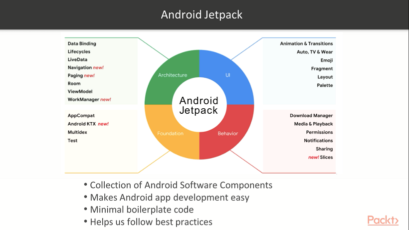
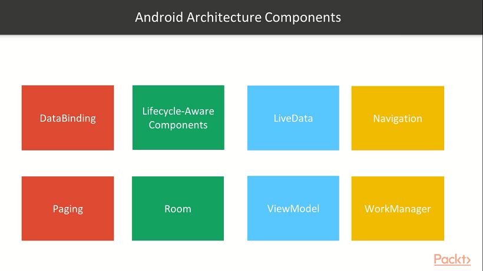

# Android Jetpack Architecture Components

[1. Data Binding](https://github.com/ujjwalmaity/AndroidJetpackArchitectureComponents/tree/master/DataBinding)

[2. Lifecycle Aware](https://github.com/ujjwalmaity/AndroidJetpackArchitectureComponents/tree/master/LifecycleAware)

[3. ViewModel LiveData](https://github.com/ujjwalmaity/AndroidJetpackArchitectureComponents/tree/master/ViewModelLiveData)

[4. Navigation](https://github.com/ujjwalmaity/AndroidJetpackArchitectureComponents/tree/master/Navigation)

[5. Paging](https://github.com/ujjwalmaity/AndroidJetpackArchitectureComponents/tree/master/Paging)

[6. Room](https://github.com/ujjwalmaity/AndroidJetpackArchitectureComponents/tree/master/Room)

[7. Work Manager](https://github.com/ujjwalmaity/AndroidJetpackArchitectureComponents/tree/master/WorkManager)

----------

